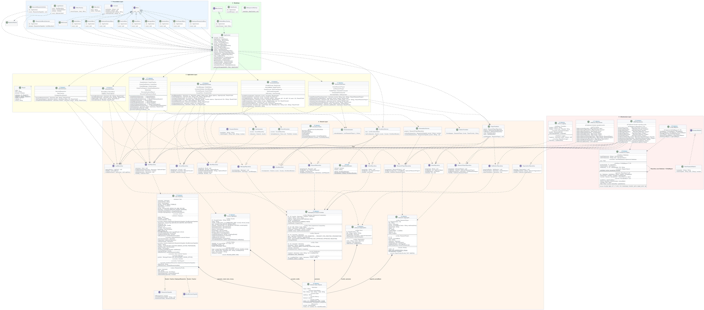

# Architecture Overview

## Clean Architecture

The University Management System is built on **Clean Architecture** with a strict,
one-directional dependency rule:

```
presentation  →  application  →  domain  ←  infrastructure
```

```
┌─────────────────────────────────────────────────────┐
│                   PRESENTATION                      │
│         CLI menus + REST controllers                │
├──────────────────────────────┬──────────────────────┤
│         APPLICATION          │                      │
│         Use cases (46)       │  INFRASTRUCTURE      │
├──────────────────────────────┤  JSON persistence    │
│           DOMAIN             │  Custom ORM          │
│  Entities, services, rules   │  Auth, i18n          │
└──────────────────────────────┴──────────────────────┘
```

### Domain Layer

The innermost layer. Contains all business logic: entities, value objects, domain services,
repository interfaces (ports), and validation rules. **Zero external imports** — not even
`java.util.logging`. It can run anywhere.

Key packages: `domain.user`, `domain.course`, `domain.research`, `domain.messaging`,
`domain.library`, `domain.service`, `domain.rules`, `domain.shared`.

### Application Layer

Use-case orchestration. Each use case is a single-responsibility class with one `execute()`
method. It calls domain objects and repository ports. It never touches I/O, HTTP, or files.

46 use cases across 7 domains: admin, course, library, messaging, organization, research, user.

### Infrastructure Layer

Implements the repository ports defined in the domain. Uses a hand-rolled JSON parser and
a custom ORM. Contains the auth filter, i18n provider, and logger adapter.

### Presentation Layer

Two independent adapters over the same application layer:
- **CLI** — interactive menus (`presentation.cli.menu.*`)
- **REST** — HTTP server and controllers (`presentation.rest.*`)

Both are wired through the same `AppContext` and share identical business logic.

## Dual-Mode Entry Point

```java
// Main.java
if (args.length > 0 && args[0].equals("--server")) {
    new RestServer(ctx, port).start();
} else {
    runCli(ctx);
}
```

Both modes construct the same `AppContext` — the same 46 use cases, 7 services,
and 6 enrollment rules serve both the CLI and the REST API.

## System Overview


